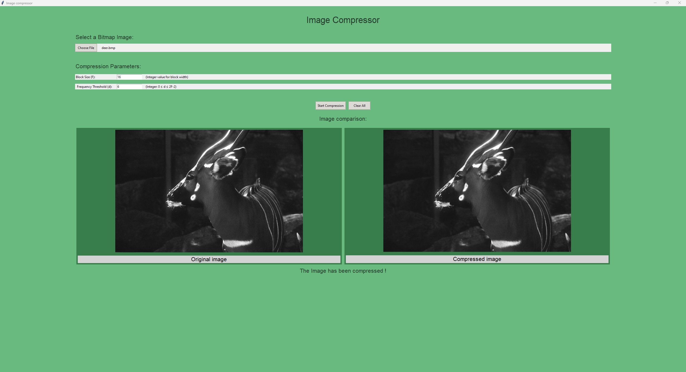

# Image Compressor

A Python application for image compression using Discrete Cosine Transform (DCT) with both custom implementation and SciPy FFT-based approaches.

## Overview

This project implements image compression using 2D Discrete Cosine Transform (DCT) on gray-scale images in .bmp format.
The application provides both a graphical user interface for interactive use and a command-line benchmark tool for performance analysis between the standard DCT approach and the FFT DCT approach, using scipy.fft version.

## Features

- **Image Compression**: Block-based DCT compression with configurable parameters
- **Dual DCT Implementation**: Custom mathematical implementation and optimized SciPy FFT version
- **Interactive GUI**: User-friendly interface for selecting images and compression parameters
- **Performance Benchmarking**: Tools to compare execution times between different DCT implementations
- **Comprehensive Testing**: Unit tests to verify DCT implementation correctness

## Project Structure

```sh
└── src/
    ├── compression_manager.py     # Main compression logic
    ├── dct.py                     # DCT implementations (custom and SciPy)
    ├── gui.py                     # Tkinter-based graphical interface
    ├── custom_exceptions.py       # Custom exception definitions
    ├── dct_comparison.py          # Performance benchmarking tools
    ├── matrix_generator.py        # Test matrix generation for benchmarks
    └── tests.py                   # Unit tests for DCT functions
```

## Installation

1. Clone the repository:

    ```sh
    git clone https://github.com/Mattia-Ingrassia/ImageCompressor.git
    cd ImageCompressor
    ```

2. Create a virtual environment:

    ```sh
    python -m venv venv
    ```

3. Activate the virtual environment:

   - On Windows:

        ```sh
        venv\Scripts\activate
        ```

   - On macOS and Linux:

        ```sh
        source venv/bin/activate
        ```

4. Install the required packages:

    ```sh
    pip install -r requirements.txt
    ```

---

## Usage

### GUI Application

Launch the graphical interface:

```bash
python gui.py
```

**Interface Features:**

- **File Selection**: Choose grayscale bitmap (.bmp) images
- **Compression Parameters**:
  - `F` (Block Size): Size of DCT blocks (e.g., 8 for 8x8 blocks)
  - `d` (Frequency Threshold): Number of low-frequency coefficients to preserve (0 ≤ d ≤ 2F-2)
- **Image Comparison**: Side-by-side view of original and compressed images
- **Real-time Validation**: Parameter validation with error messages



### Performance Benchmarking

Generate test matrices and run performance comparison:

```bash
# Generate benchmark matrices
python matrix_generator.py

# Run DCT performance comparison
python dct_comparison.py
```

This creates:

- `dct_benchmark_results.json`: Detailed timing results
- `DCT_comparison.png`: Performance visualization

## Compression Parameters

### Block Size (F)

- Determines the size of DCT blocks (F×F)
- Common values: 8, 16, 32
- Larger blocks: Better compression, more processing time
- Smaller blocks: Faster processing, less compression

### Frequency Threshold (d)

- Number of low-frequency DCT coefficients to retain
- Range: 0 ≤ d ≤ 2F-2
- Lower values: Higher compression, more quality loss
- Higher values: Lower compression, better quality preservation

## Algorithm Details

The compression process follows these steps:

1. **Image Preprocessing**: Convert to grayscale and crop to block-aligned dimensions
2. **Block Division**: Split image into F×F blocks
3. **DCT Transform**: Apply 2D DCT to each block
4. **Frequency Filtering**: Retain only the first `d` low-frequency coefficients
5. **Inverse DCT**: Transform filtered coefficients back to spatial domain
6. **Image Reconstruction**: Reassemble blocks into final compressed image

## Testing

Run the test suite:

```bash
python tests.py
```

Tests verify:

- 1D DCT correctness
- 2D DCT correctness
- Consistency between custom and SciPy implementations

## Output

- Compressed images are saved in the `output_images/` folder
- Filenames follow the pattern: `compressed_[original_name].bmp`
- Images are saved as 8-bit grayscale bitmaps
